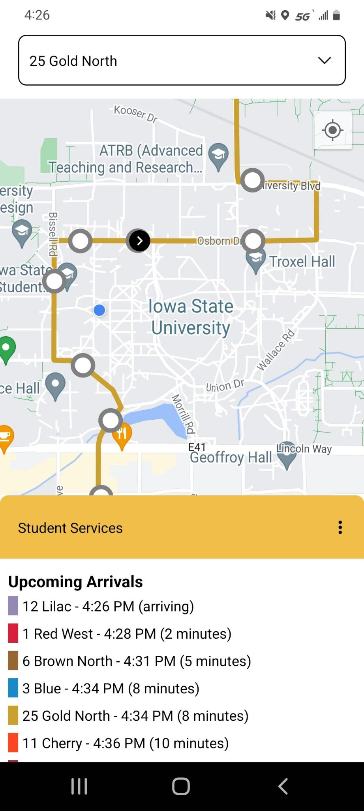
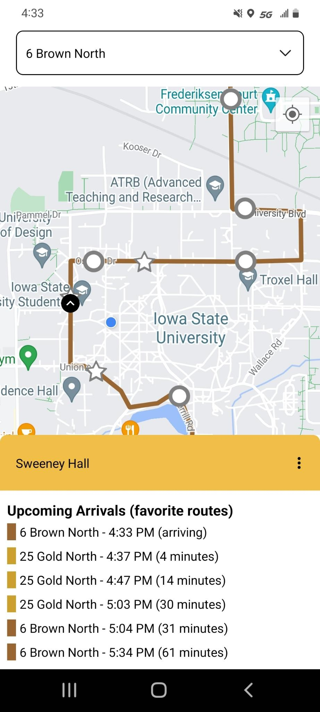
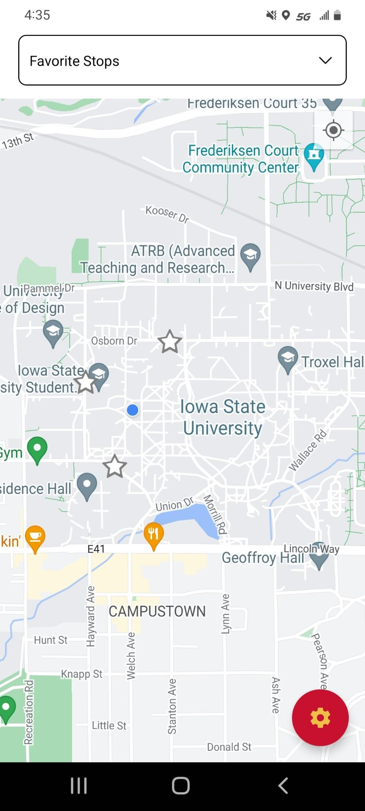
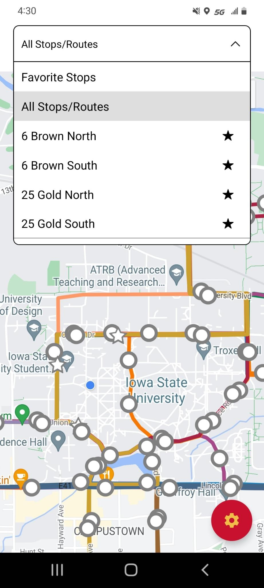

# Ames Ride

When using public transportation, it is vital to know where your bus is.
In Ames, Iowa, there are two existing applications which attempt to cater to this need.
With ratings on the Play Store of 1.9 stars and 2.3 stars, the existing solutions are unreliable and unmaintained.

**Ames Ride** strives to be a reliable, modern application that informs riders of current bus locations and arrival times.

# Download

The app is available on the [Google Play Store](https://play.google.com/store/apps/details?id=com.demerstech.amesride) or as an APK in the [releases](https://github.com/patrickdemers6/AmesRide/releases) section.

# Features

Ames Ride has nearly all features present in alternative applications.

- View busses on a given route.
- Mark your frequent routes as favorites.
- View arrival times at a particular stop.

To ensure reliability, Ames Ride does not allow users to view multiple routes at a time.
Switching routes is a simple tap away!

## Screenshots

<table>
    <tr>
        <td>
            <h4>View upcoming arrivals for <strong>all</strong> routes at a stop</h4>
            
        </td>
        <td>
            <h4>View upcoming arrivals for <strong>favorite</strong> routes at a stop</h4>
            
        </td>
        <td>
            <h4>Mark your Favorite Stops</h4>
            
        </td>
        <td>
            <h4>Mark your Favorite Routes</h4>
            
        </td>
    </tr>
</table>

# Permissions

- Location: Ames Ride requests location permissions to locate the user on the map. This permission is not required.

# Privacy

This application does not log or store user data.

However, the application does communicate with third party services during normal usage.

## External Services

- **Google Maps** is used to display the map within the application. [Google privacy policy](https://policies.google.com/privacy).
- **CyRide API** is used to fetch details about routes, bus stops, vehicles, etc. This API is powered by GMV. Their [privacy policy](https://www.gmv.com/en-es/privacy-policy).
- **Expo** is used to manage app deployments. When you launch the application, a request is sent to Expo to check if a new version is available. If there is a new version of the application, it will then be downloaded from Expo's servers. Expo does not collect end-user data. [Privacy policy](https://expo.dev/privacy).

# Assets

## Icon

The icon was generated using [Android Asset Studio](<https://romannurik.github.io/AndroidAssetStudio/icons-launcher.html#foreground.type=clipart&foreground.clipart=directions_bus&foreground.space.trim=1&foreground.space.pad=0.25&foreColor=rgb(241%2C%20190%2C%2073)&backColor=rgb(200%2C%2016%2C%2047)&crop=0&backgroundShape=circle&effects=none&name=ic_launcher>).
